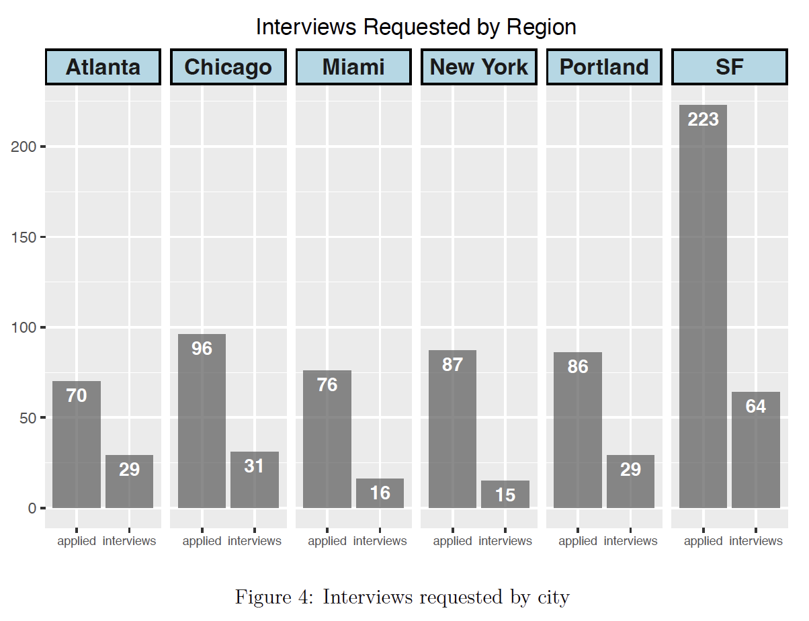
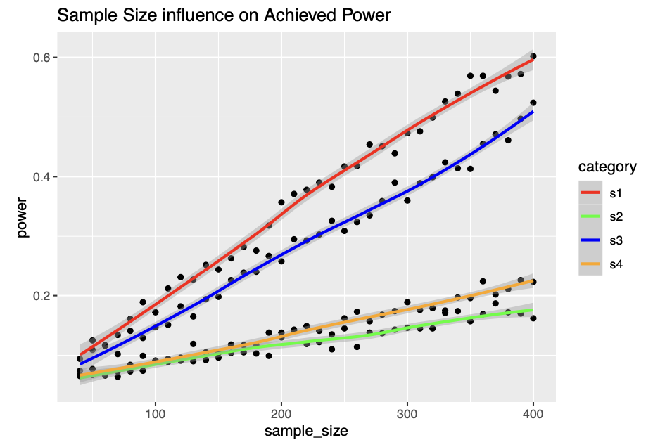
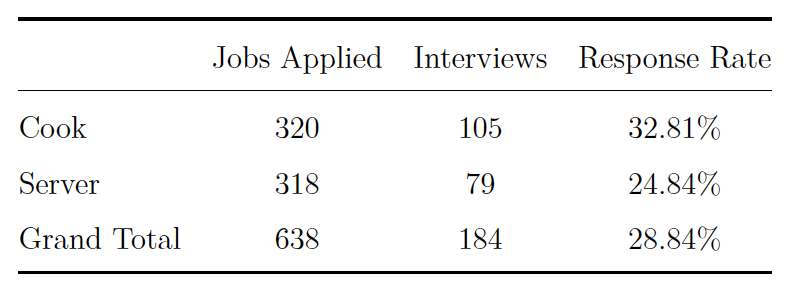
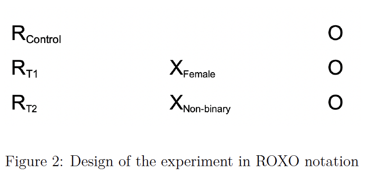

# Project Title

## Overview

This project is a comprehensive exploration into the realm of data collection, analysis, and automation. The primary goal was to streamline the process of data gathering and analysis, and to provide insights into the data using statistical methods. The project also aimed to contribute to the conversation on gender disparity in the food-service industry by conducting an experiment to explore whether gender implicit bias exists in hiring practices.

## Technical and Structural Aspects

The project structure is organized in a way that allows for easy navigation and understanding of the various components. The Python scripts for data collection and automation are stored in separate directories, and the R scripts for statistical analysis are also neatly organized.

## Statistical Analysis

The statistical analysis was conducted using R. The analysis includes various techniques such as covariate balance checks and power analysis. 

The R scripts provide a detailed view of the statistical methods used, and they can be a valuable resource for anyone interested in statistical analysis.

The analysis was conducted using several models. The base model regressed the outcome on the treatment. The second model included covariates, and the third model examined heterogeneous treatment effects for the front and back of house. The final model added fixed effects for location, time-base of employment, and finer-grained categories for the type of job that was advertised.

Covariate balance checks were conducted to ensure that the randomization procedure worked. This involved creating a null model by regressing the treatment indicator on 1, and then regressing the treatment indicator on all of the covariates. Comparing these models via F-test tells us whether including covariates improves our ability to predict the treatment condition. If the covariates do collectively help us predict the treatment condition, there is cause for concern about our randomization process. In this study, no model showed a significant improvement when covariates were added, providing evidence to support our assertion that Craigslist ad ordering was sufficiently statistically independent of any other feature of our experiment to be considered random.

## Study Design

The study involved a randomized auditing experiment spanning four weeks and encompassing six cities. More than 600 near-identical resumes were sent out, only changing the names to imply different genders. The study focused on the initial contact stage with the employer, measuring their interest or disinterest in a candidate as a binary outcome.

## Results

The study found that the response rate was higher for male and female applicants compared to non-binary applicants. Furthermore, the server response rate was much lower than for cooks, suggesting that restaurants were more selective with front-of-house server roles than back-of-house cook roles.

Despite the lack of effects that reach the threshold for statistical significance, we do note that the non-binary resume had approximately a 5% lower response rate across the board (approx. 30% for men and women, 25% for non-binary). This is both consistent with our original hypothesis and practically significant. Had the people reflected in our resumes been real, the non-binary job seeker would have been denied about 1/6 of interview opportunities offered to their peers.

## Power Analysis

In revisiting the power calculations conducted prior to the study, we find that to reliably detect a true underlying difference of 5% between any one treatment group and the control group, our sample size would need to be 4-5 times larger than it was for this study. Time constraints and limits imposed by email services and Craigslist would have made such a sample size nearly impossible in this study, but it does provide insight into how future work might improve upon our research.

## Contributions

This project was a collaborative effort, and each team member contributed significantly to its success. My major contributions were in the development of the web scraper and the automation process using Google API and Python, as well as in the statistical analysis using R.

One of my major contributions of this project was the development of a web scraper using Google API and Python. This tool is capable of collecting large amounts of data and populating Google Sheets automatically. It also has the functionality to write and send emails, thereby automating a significant part of the process. I was also involved in the study design, and the power and statistical analysis.

