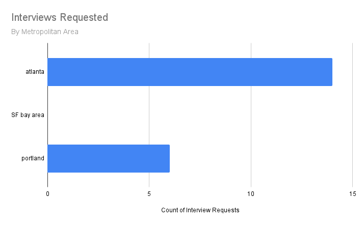
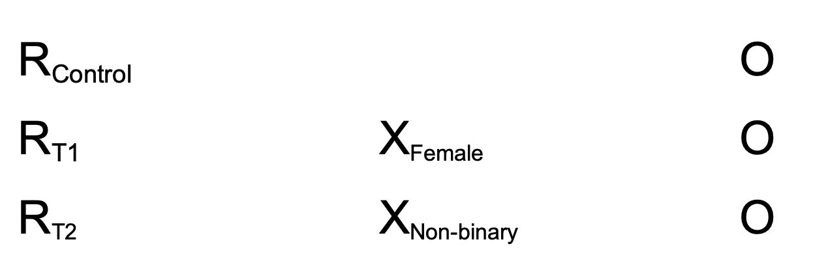
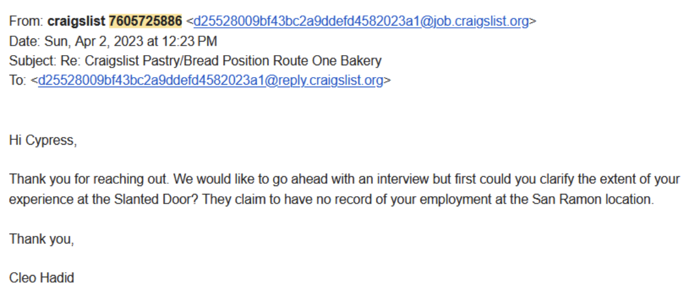

```{r setup, include=FALSE}
knitr::opts_chunk$set(echo = TRUE)
library(ggplot2)
library(dplyr)
library(data.table)
library(stargazer)
library(sandwich)
library(lmtest)
library(magrittr)
d <- fread('data_for_analysis.csv')
```

\newpage

## Introduction

Despite the shift toward greater inclusivity in the cultural landscape, gender disparity in industries remains a persistent issue. While many organizations have implemented diversity initiatives in recent years to promote equal representation, their effectiveness and level of commitment vary. However, fewer such initiatives have been implemented in blue-collar industries, which have traditionally been heavily male-dominated. This trend is particularly evident in the food-service sector, where men comprise 61.3% of US restaurant workers.

What is the root cause of this gender imbalance in the food sector? Do more men apply to cook positions as a reflection of broader internalized gender-role expectations? Does the lopsided representation suggest implicit gender bias held by employers? These queries become even more complicated as our understanding and definition of gender evolve and expand to include non-binary individuals. While this is a complex issue without a simple solution, our study aims to contribute to the conversation by taking a step forward in understanding it. To do so, we have designed an experiment to explore whether gender implicit bias exists in hiring practices in the food service industry.

## Background

Multiple studies have examined this very question in other employment sectors. For example, in one experiment conducted between 2016-2018, researchers contacted companies and asked employers to rate resumes. The study found evidence of bias favoring male candidates in specific industries, such as STEM, despite them actively promoting diversity[^1]. Similarly, though not directly related to gender, another field study was conducted where fictitious resumes were sent in response to job ads, with the candidate's name alternating between a "very African American sounding name or a very White sounding name". The results showed a significant employer preference for the White sounding names, highlighting the influence of implicit bias in the hiring process among employers.

Despite the numerous experiments exploring hiring practices, most have focused on white-collar industries (which may suggest bias among researchers). Furthermore, another limitation of the studies examining gender disparity in the workplace is the absence of a non-binary category. However, one notable exception is an experiment conducted by business.com, where resumes with gender-ambiguous names were sent out. Half contained they/them pronouns while the others did not include any pronouns. Surprisingly, the resumes with pronouns received 8% less interest, despite most contacted companies identifying as equal-opportunity employers.

It's crucial to acknowledge that the non-binary study previously mentioned did not include she/her and he/him resumes, so we cannot be certain if they would have performed similarly. This raises the possibility that the mere inclusion of pronouns could have acted as a deterrent to hiring, as stating gender pronouns can be a contentious issue and may have turned off some employers. The researchers may have observed a similar bias against male resumes that included pronouns, compared to those that included nonbinary ones. 


Nevertheless, other sources provide evidence that non-binary discrimination exists at a fundamental level. In a study, researchers showed participants various gender-ambiguous faces created by blending male and female features. They found that the mental work of classifying the faces “seemed to produce cognitive disfluency” leading to a negative reception[^2]. Although this was a broader study, this observed discomfort with non-binary individuals may spill over into the hiring process when employers struggle to categorize candidates into a simple binary box.

[^1]:Judd B. Kessler, Corinne Low, Colin D. Sullivan. 2019. Incentivized Resume Rating: Eliciting Employer Preferences without Deception. American Economic Review Vol. 109, No. 11

[^2]:Helen E. Owen, Jamin Halberstadt, Evan W. Carr, Piotr Winkielman. 2016. Johnny Depp, Reconsidered: How Category-Relative Processing Fluency Determines the Appeal of Gender Ambiguity

## Pilot Study

Before conducting the full-scale experiment, we performed a manipulation check to evaluate our treatment delivery. We sent 15 emails for each of the six treatment variations. Of these, three were discarded due to scraper error, and one received an auto-reply. Ultimately, we received 21 interview requests, yielding a 23.3% response.

\newpage 

*Table 1: Pilot Study*

|Resume Version|     Name     |   Pronoun  |       Emails Sent      |
|:------------:|:------------:|:----------:|:----------------------:|
|      1       |    Charles   | No Pronoun |5 x 3 metros = 15 emails|
|      2       |    Claire    | No Pronoun |5 x 3 metros = 15 emails|
|      3       |    Cypress   | No Pronoun |5 x 3 metros = 15 emails| 
|      4       |    Charles   | He/Him     |5 x 3 metros = 15 emails|
|      5       |    Claire    | She/Her    |5 x 3 metros = 15 emails|
|      6       |    Cypress   | They/Them  |5 x 3 metros = 15 emails|


However, we identified a potential challenge: we had not received responses from San Francisco-based restaurants. We have ruled out issues with sending emails to San Francisco, leading us to suspect Craigslist may be blocking some of our emails. Although we have resolved this issue in our full-scale experiment, this may threaten the integrity of our results.


```{r echo=FALSE, out.width = "80%", fig.cap = "Interviews requested by city", fig.align = "center"}

```


## Methods/Experimental Design

### Hypotheses

We wanted to build on the growing literature on gender disparity in the workforce by conducting a study that focused on the blue-collar food-service industry. Additionally, as non-binary people are an increasingly visible but often overlooked demographic, we expanded our study to include this group. Our study involved a randomized auditing experiment spanning four weeks and encompassing six cities. We sent out more than 600 near-identical resumes, only changing the names between "Charles Miller," "Claire Miller," and "Cypress Miller" to imply different genders. In addition, we included he/him, she/her, and they/them pronouns in all resumes. Though adding pronouns may have deterred some employers, their consistent use in both treatment and control groups allowed us to measure any gender bias apart from their inclusion. 

Interestingly, though maybe not surprisingly, although the restaurant industry is dominated by men, 68.0% of all servers are women[^3]. So, we further divided our analysis into front-of-house positions (FOH) and back-of-house positions (BOH), which are generally considered more skill-based (we do not subscribe to this belief). We then developed two versions of the resume for each gender, one emphasizing cooking experience and the other highlighting serving experience. This approach increased our likelihood of capturing any potential bias in either direction.

Based on the gender disparities documented in the food sector industry and previous research on workplace bias, our central hypothesis was that implicit gender bias would exist in restaurant hiring practices, resulting in a higher rate of interview requests for men applying for back-of-house positions. Conversely, we expected a preference for women in front-of-house roles. Although there is limited data on non-binary individuals in the food-service industry, preliminary studies suggested that they would receive fewer interview requests than male and female applicants.

[^3]: https://www.zippia.com/restaurant-worker-jobs/demographics/

### Research Design & Measurement


```{r echo=FALSE, out.width = "60%", fig.cap="Design of the experiment in ROXO notation", fig.align = "center"}

```


Our experimental audit study design is illustrated in the diagram above. The randomized intervention consists of one control and two treatments. The male candidate's resume served as our baseline control, while the two treatments were the female and non-binary resumes. Given our study's time and resource limitations, we focused solely on the initial contact stage with the employer,  measuring their interest or disinterest in a candidate as a binary outcome. 0 denoted no interest and 1 represented interest. In the context of our study, 'interest' referred to any personalized message requesting an interview. 'No interest' included form responses that did not advance the hiring process and overtly dismissive messages from the employer.

When the employer did not respond within one week, we marked it 0 for ‘no interest.’ This cut-off time was a necessity due to our relatively short research window. While this does not rule out the possibility of receiving a response at a later time, we observed that the majority of responses came within days of applying due to the high-turnover nature of the industry. Therefore, we inferred that any response received after one week likely indicated a lower level of interest from the employer.


- **Y(0): Form, Negative, or No Response**

- **Y(1): Personalized Request for Interview**

\newpage
*Example 1: A personalized request for an interview. We record these as positive outcomes (Y = 1)*


```{r echo=FALSE, out.width = "80%", fig.align = "left"}

```


*Example 2: A generic “form” reply. This would be considered a negative signal (Y = 0)*


```{r echo=FALSE, out.width = "80%", fig.align = "left"}

```


*Example 3: A negative outcome (Y = 0) in which the restaurant owner performed due diligence and discovered that we had fabricated our resumes*


```{r echo=FALSE, out.width = "80%",  fig.align = "left"}

```


*Example 4: Yet another negative outcome (Y = 0). The most common complaint is that we do not list a phone number on our resumes. Unfortunately, this was deliberate to prevent restaurant owners from discovering that our candidates are fake*


```{r echo=FALSE, out.width = "80%", fig.align = "left"}

```


### Participants

To find job postings for the food-service industry, we relied on Craigslist as it is widely used in this sector. To gather data efficiently, we developed a web-scraping tool that allowed us to extract contact information and other potentially relevant information. After experiencing issues with Craigslist flagging us in our pilot study, we adopted a more cautious approach by scraping ads in small batches of thirty and immediately sending out resumes before scraping for more. This strategy had the added advantage of allowing us to target recently posted ads, which we found to be more likely to elicit responses.

We scraped ads from six cities: Chicago, Portland, Atlanta, San Francisco, Miami, and New York. These cities were chosen to ensure that we could get enough observations.  We were not expecting or interested in variance between cities. However, we ended up using the cities as covariates in our analysis.


### Process and Randomization

Craigslist organizes food-service ads solely by their posting time, without any specific order. This means that fast food, cafes, bars, fancy restaurants, and various job positions are all intermingled.  So, scraping the ads was a natural randomization method. We then used a Python script to go down the list of collected emails and send out resumes, alternating between the three genders to ensure that no gender had an advantage in accessing the most recent jobs. 

We created nine Gmail accounts, three for each fictional candidate as a way to minimize the potential of being flagged for SPAM. The Python script  alternated between these email accounts, attaching either the gender’s service resume or cook resume, depending on the job offered, as a PDF.  Additionally, it generated a cover letter from one template, only updating the restaurant's name and the position offered, as shown in Figure 3 below. 


```{r echo=FALSE, out.width = "80%", fig.cap="Example email sent in response to a Craiglist posting",  fig.align = "left"}

```


### Non-Compliance and Attrition

As we did not have direct access to our "participants," measuring attrition or compliance was not possible. However, we occasionally received email bouncebacks, which we attributed to employers taking down their ads after filling the position. To ensure the accuracy of our observations, we removed these bouncebacks from our dataset. One potential concern would be that there is something fundamentally different about employers who take down their ads, and that by removing them would introduce bias into our results. However, since all employers eventually removed their ads, we felt confident in our decision to disregard these bouncebacks, and the comparison remained valid.


## Descriptive Statistics

A total of 638 resumes were emailed to food services jobs on Craigslist. Of these 638 emails, we received 184 replies, yielding a 28.84% response rate. Interestingly, the non-binary treatment had a much lower response rate.

\newpage
*Table 2: Response rates by treatment*
   
|                                  | Jobs Applied | Interviews | Response Rate |
|:---------------------------------|:------------:|:----------:|:-------------:|
| Control (Charles, Male)          |     221      |     67     |    30.32%     |
| Treatment 1 (Claire, Female)     |     213      |     65     |    30.52%     |
| Treatment 2 (Cypress, Non-Binary)|     204      |     52     |    25.49%     |  
| Grand Total                      |     638      |     184    |    28.84%     |  
  
  
Regarding job function, we observed that the server response rate was much lower than for cooks. This suggests that restaurants were more selective with front-of-house server roles than back-of-house cook roles. This specific distinction in selectivity between front-of-house and back-of-house may help reveal inherent biases in the hiring process.


*Table 3: Response rates by role*


|             | Jobs Applied | Interviews | Response Rate |
|:------------|:------------:|:----------:|:-------------:|
| Cook        |     320      |     105    |    32.81%     |
| Server      |     318      |     79     |    24.84%     |
| Grand Total |     638      |     184    |    28.84%     | 


As for geography, we found that San Francisco-based restaurants had the highest response rate among the cities included in our experiment, which was surprising given that our pilot study received no responses from this region. But, again, this outcome demonstrates that the results of our study are directly influenced by how well we can deliver our treatment.


```{r interviews_requested_by_city, fig.cap="Interviews requested by city",  echo = FALSE}
# Manually input data into dataframe
region <- c("Atlanta", "Atlanta", "Chicago", "Chicago", "New York", "New York", "Portland", "Portland", "SF", "SF", "Miami", "Miami")
category <- c("applied", "interviews", "applied", "interviews", "applied", "interviews", "applied", "interviews", "applied", "interviews", "applied", "interviews")
count <- c(70, 29, 96, 31, 87, 15, 86, 29, 223, 64, 76, 16)
results <- data.frame(region, category, count)

# Generate Histograms
ggplot(data = results, aes(x = category, y = count)) +
  geom_bar(stat = "identity", alpha = 0.7) +
  facet_grid(. ~region) +
  geom_text(aes(label = count), fontface = "bold", vjust = 1.5, colour = "white", size = 4) +
  labs(x = element_blank(), y = element_blank(), title = "Interviews Requested by Region") +
  theme(plot.title = element_text(hjust = 0.5), 
      legend.title = element_text(face="bold", size = 10),
      strip.background = element_rect(fill="lightblue", colour="black", size=1),
      strip.text = element_text(face="bold", size=rel(1.2)),
      axis.text.x=element_text(size=7)
  )
```


Finally, we present a count of responses by treatment. Further discussion of these results will be provided in the subsequent sections, where we will conduct a regression analysis.


```{r interviews_requested_by_treatment, fig.cap="Interviews requested by treatment", echo = FALSE}
# Manually input data into dataframe
region <- c("Charles (Male)", "Charles (Male)", "Claire (Female)", "Claire (Female)", "Cypress (Non-Binary)", "Cypress (Non-Binary)")
category <- c("applied", "interviews", "applied", "interviews", "applied", "interviews")
count <- c(221, 67, 213, 65, 204, 52)
results <- data.frame(region, category, count)

# Generate Histograms
ggplot(data = results, aes(x = category, y = count)) +
  geom_bar(stat = "identity", alpha = 0.7) +
  facet_grid(. ~region) +
  geom_text(aes(label = count), fontface = "bold", vjust = 1.5, colour = "white", size = 4) +
  labs(x = element_blank(), y = element_blank(), title = "Interviews Requested by Gender Affiliation") +
  theme(plot.title = element_text(hjust = 0.5), 
      legend.title = element_text(face="bold", size = 10),
      strip.background = element_rect(fill="lightblue", colour="black", size=1),
      strip.text = element_text(face="bold", size=rel(1.2))
      )
```


## Regression Results & Model Selection


### Covariate Balance Check

Because we relied on Craigslist's default ad sorting to randomize our treatments (reverse chronological by posting time in each city), we thought it wise to conduct a covariate balance check to help ensure that the randomization procedure worked. In Field Experiments[^4], Gerber & Green detail a covariate balance check for binary treatments wherein we first create a null model by regressing the treatment indicator on 1 (e.g., `lm(treatment ~ 1)`), and then we regress the treatment indicator on all of the covariates. Comparing these models via F-test tells us whether including covariates improves our ability to predict the treatment condition. If the covariates do collectively help us predict the treatment condition, there is cause for concern about our randomization process. This clever method minimizes multiple comparison concerns and provides an easily interpreted test.

We had two treatment groups and one control, so this process was slightly more complex. We elected to specify three regressions to represent all possible pairings of groups, and three analogous null models for comparison via F-test. The regressions were of the form 

$\widehat{treatment} = \beta_0 + \beta_1covariate_1 + ... + \beta_ncovariate_n$

and included all covariates that were later used in the regression. For each version of the model, we restricted the data to only include one control/treatment pair. The three pairings we used were man and woman, man and nonbinary, woman and nonbinary. Therefore, each possible combination was accounted for, and we only needed to interpret three F-tests. No model showed a significant improvement when covariates were added, providing evidence to support our assertion that Craigslist ad ordering was sufficiently statistically independent of any other feature of our experiment to be considered random.

[^4]:Gerber, Alan S., and Donald P. Green. 2012. Field Experiments: Design, Analysis, and Interpretation. New York: W.W. Norton


To understand the effect of stated gender on job interview offers, we specify three nested regression models of the form

$\widehat{interview\_requested} = \beta_0 + \beta_1 woman + \beta_2 nonbinary + Z_\gamma$

where $Z_\gamma$ represents additional covariates added to increase statistical precision. The first model includes only the outcome and the treatment. The second model adds covariates indicating whether the job posting was for a front-of-house (e.g., server, host) position or a back-of-house (e.g., line cook, chef) position. The final model adds fixed effects for location, time-base of employment, and finer-grained categories for the type of job that was advertised. These covariates were added to increase statistical precision by reducing standard errors on the treatment variables. In theory, this should improve our ability to detect a treatment effect. We don’t interpret the significance of any covariates because they were not randomized and were only included for this limited purpose. Table 4 shows the results of these regressions.

```{r make regular models, echo=FALSE}
# base model and its associated coeftest
base_model <- d[ , lm(interview_requested_binary ~ factor(treatment))]
base_model_se <- base_model %>% vcovHC(type = "HC0") %>% diag() %>% sqrt()
base_model$vcovHC_ <- vcovHC(base_model, type='HC0')
base_coeftest <- coeftest(base_model, vcov. = base_model$vcovHC_)

# model including job type as a covariate
model_job_type <- d[ , lm(interview_requested_binary ~ factor(treatment) + factor(foh_boh))]
job_model_se <- model_job_type %>% vcovHC(type = "HC0") %>% diag() %>% sqrt()
model_job_type$vcovHC_ <- vcovHC(model_job_type, type='HC0')
job_type_coeftest <- coeftest(model_job_type, vcov. = model_job_type$vcovHC_)

# full model with all covariates
model_full <- d[ , lm(interview_requested_binary ~ factor(treatment) + factor(foh_boh) + factor(area) + factor(job_category) + factor(time_base))]
full_model_se <- model_full %>% vcovHC(type = "HC0") %>% diag() %>% sqrt()
model_full$vcovHC_ <- vcovHC(model_full, type='HC0')
full_coeftest <- coeftest(model_full, vcov. = model_full$vcovHC_)
```

```{r table for models, message=FALSE, echo=FALSE, results='asis'}
stargazer(base_model, model_job_type, model_full, 
          se = list(base_model_se, job_model_se, full_model_se),
          title = 'Estimated Regressions',
          header = FALSE,
          omit=c('factor\\(area\\)*', 'factor\\(City\\)*', 'factor\\(job_category\\)*', 'factor\\(time_base\\)*'), 
          type='latex',
          add.lines = list(c("Fixed effects?", "No", "No", "Yes")),
          column.labels = c("Base", "Job Type", "Full"),
          dep.var.labels = 'Interview Requested',
          covariate.labels = c('Nonbinary Resume', 'Woman Resume', 'BOH Position', 'FOH Position', 'Constant'),
          notes = "\\parbox[t]{.75\\textwidth}{$HC0$ robust standard errors in parentheses.\\\\  Fixed effects are time base, location, and job category.}", notes.align='l',
          single.row = TRUE,
          no.space = TRUE,
          font.size = 'small',
          omit.stat=c("adj.rsq"),
          table.placement = 'H')
```


We also specify a model intended to assess the existence of heterogeneous treatment effects based on whether the job was a front-of-house (FOH) or back-of-house (BOH) position. This model is of the form 

$\widehat{interview\_requested} = \beta_0 + \beta_1woman + \beta_2nonbinary + \beta_3 woman \times FOH + \beta_4 woman \times BOH + \beta_5 nonbinary \times FOH + \beta_6 nonbinary \times BOH + Z_\gamma$

where $Z_\gamma$ again represents additional covariates. The results of this regression are in Table 5. We find no significant heterogeneity in our treatment effects based on the job type. 

```{r job type HTEs, echo=FALSE}
model_hte <- d[ , lm(interview_requested_binary ~  factor(treatment) + factor(foh_boh) + factor(treatment):factor(foh_boh) + factor(area) + factor(job_category) + factor(time_base))]
hte_se <- model_hte %>% vcovHC(type = "HC0") %>% diag() %>% sqrt()
model_hte$vcovHC_ <- vcovHC(model_hte, type='HC0')
hte_coeftest <- coeftest(model_hte, vcov. = model_hte$vcovHC_)

#hte_coeftest
#summary(model_hte)
```


```{r table for job type HTE, message=FALSE, echo=FALSE, results='asis'}
stargazer(model_hte,
          title = 'Job Type HTE Model',
          header = FALSE,
          se = list(hte_se),
          dep.var.labels = 'Interview Requested',
          column.sep.width = '-5pt',
          omit=c('factor\\(job_category\\)*', 'factor\\(time_base\\)*', 'factor\\(area\\)*', 'factor\\(treatment\\)Woman\\:factor\\(foh_boh\\)FOH','factor\\(treatment\\)Nonbinary\\:factor\\(foh_boh\\)FOH'), 
          type='latex',
          covariate.labels = c('Nonbinary Resume', 'Woman Resume', 'BOH Position', 'FOH Position', 'Nonbinary × BOH', 'Woman × BOH', 'Constant'),
          add.lines = list(c("Fixed effects?", "Yes")),
          notes = "\\parbox[t]{.75\\textwidth}{$HC0$ robust standard errors in parentheses.\\\\  Fixed effects are time base, location, and job category.}", notes.align='l',
          single.row = TRUE,
          no.space = TRUE,
          font.size = 'small',
          omit.stat=c("adj.rsq","f"),
          table.placement = 'H')
```


Finally, we specify a model to assess heterogeneous treatment effects by city. This model was of the form

$\widehat{interview\_requested} = \beta_0 + \beta_1woman + \beta_2nonbinary + \beta_3 woman \times City_1 + \beta_4 nonbinary \times City_1 + … + \beta_n woman \times City_n + \beta_n nonbinary \times City_n + Z_\gamma$

where $Z_\gamma$ represents additional covariates. Again we find no significant heterogeneous treatment effects when the city was interacted with the treatment. The results of this regression are available in Table 6.

```{r city HTEs, echo=FALSE}
model_hte_city <- d[ , lm(interview_requested_binary ~ factor(treatment) + factor(City) + factor(treatment):factor(City) + factor(foh_boh) + factor(job_category) + factor(time_base))]
city_se <- model_hte_city %>% vcovHC(type = "HC0") %>% diag() %>% sqrt()
model_hte_city$vcovHC_ <- vcovHC(model_hte_city, type='HC0')
hte_coeftest_city <- coeftest(model_hte_city, vcov. = model_hte_city$vcovHC_)

#summary(model_hte_city)
#hte_coeftest_city
```

```{r table for city HTEs, message=FALSE, echo=FALSE, results='asis'}
stargazer(model_hte_city, omit=c('factor\\(job_category\\)*', 'factor\\(time_base\\)*', 'factor\\(foh_boh\\)*'), 
          se = list(city_se),
          title = 'City HTE Model',
          dep.var.labels = 'Interview Requested',
          header = FALSE,
          type='latex',
          column.sep.width = '-5pt',
          add.lines = list(c("Fixed effects?", "Yes")),
          covariate.labels = c('Nonbinary Resume', 'Woman Resume', 'Chicago Job', 'New York Job', 'Portland Job', 'SF Bay Area Job', 'South Florida Job', 'Nonbinary × Chicago', 'Woman × Chicago', 'Nonbinary × New York', 'Woman × New York', 'Nonbinary × Portland', 'Woman × Portland', 'Nonbinary × SF Bay Area', 'Woman × SF Bay Area', 'Nonbinary × South Florida', 'Woman × South Florida', 'Constant'),
          notes = "\\parbox[t]{.75\\textwidth}{$HC0$ robust standard errors in parentheses.\\\\  Fixed effects are time base, FOH vs. BOH position, and job category.}", notes.align='l',
          single.row = TRUE,
          no.space = TRUE,
          font.size = 'small',
          omit.stat=c("adj.rsq","f"),
          table.placement = 'H')
```

## Discussion

Our analysis does not provide evidence that leads us to reject the null hypothesis that there is no bias in food service hiring practices. The regression results further indicate that no heterogeneous treatment effects exist when we examine whether the treatment may have had a different effect on front-of-house and back-of-house positions or on different cities. Despite the lack of effects that reach the threshold for statistical significance, we do note that the non-binary resume had a somewhat negative coefficient in all regressions (approx. -0.05). This is both consistent with our original hypothesis and practically significant. Had the people reflected in our resumes been real, the non-binary job seeker would have been denied a nontrivial number of interview opportunities offered to their peers. We suspect that this effect is real and, had our experiment been sufficiently powered, would have been detectable. This leaves open an avenue for future research with a larger sample size.

## Limitations

Several caveats and limitations, discussed below, apply to our conclusions.

**1. Generalizability**

This experiment is limited in its generalizability to the greater population of food service jobs in important ways. We collected job postings only from Craigslist, and as such we were limited to jobs in large metropolitan areas where Craigslist provides services. This means that rural areas were excluded, as were jobs posted only on other services or advertised through more traditional means such as window signs or word-of-mouth. To be specific, our results only apply to units in our sample from the cities in which we gathered resumes. The nature of a randomized experiment means we are unable to make general statements about the underlying population from which our sample was drawn.

**2. Statistical Power**

In revisiting the power calculations conducted prior to the study, we find that to reliably detect a true underlying difference of 5% between any one treatment group and the control group, our sample size would need to be 4-5 times larger than it was for this study. Time constraints and limits imposed by email services and Craigslist would have made such a sample size nearly impossible in this study, but it does provide insight into how future work might improve upon our research.

**3. Audit study**

This was an audit study, meaning it only examined part of the transaction of interest. In our case, we only looked at the very first part of the hiring process: submitting a resume and being offered an interview. While this is a key step in getting hired, it is far from a complete picture, and we believe that gender bias could manifest itself at any point in the process.

**4. Not enough names**

Prior work using names to signal race to politicians has used a multitude of names to ensure that no single name has unusual effects on the participants.[^5] While we attempted to choose names that were fairly neutral and we had the benefit of directly signaling gender via pronouns, future work should consider using a wider variety of names to more precisely estimate the effect of stated gender.

[^5]: Hughes, D., Gell-Redman, M., Crabtree, C., Krishnaswami, N., Rodenberger, D., & Monge, G. (2020). Persistent Bias Among Local Election Officials. Journal of Experimental Political Science, 7(3), 179-187. doi:10.1017/XPS.2019.23

## Conclusion

We conducted an audit study of the application to first interview part of the hiring process for food service jobs posted on Craigslist. We experimentally varied the stated gender of the applicant by both changing the name and the pronouns written on the resume. We included resumes with he/him, she/her, and they/them pronouns. Resumes were customized for each city, but within each city, each resume was identical except for the name and pronoun differences. 

Our analysis found no statistically significant effects for either treatment resume (woman and nonbinary). We do note that the coefficient on the nonbinary resume was negative and large enough to imply a practically significant difference of about 5%, meaning that a nonbinary candidate would be approximately 5% less likely than their peers to receive an interview for a position based on their resume. If such an effect does indeed exist in the underlying population, it would have nontrivial effects on a group that already faces increased prejudice in our society.

Assessing the existence of heterogeneous treatment effects by both job type (front-of-house vs. back-of-house) and city also showed no effects that reached the threshold of statistical significance. 

Our experiment was limited by several factors, including sample size, name re-use, and not capturing the whole hiring process. As such, we believe our results to be reliable and unbiased for the sample that was studied, but future work should seek to improve upon our research by including more names on the resumes and having a larger sample size. We further recognize that this research was conducted on jobs posted on Craigslist in large metropolitan areas in the U.S., and the results probably do not generalize to more rural areas, which are likely to hold different social biases on average from people living in cities. We feel that this is an important area of study, both because this work included nonbinary resumes and because it was conducted in a field in which gender bias is poorly understood. Our hope is that further work in this area could illuminate effects that we were unable to detect.
